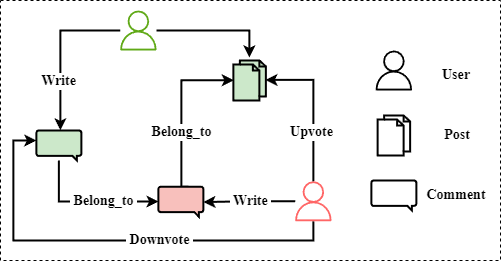
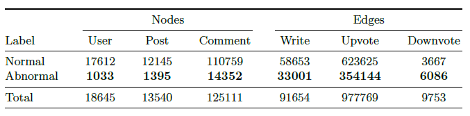
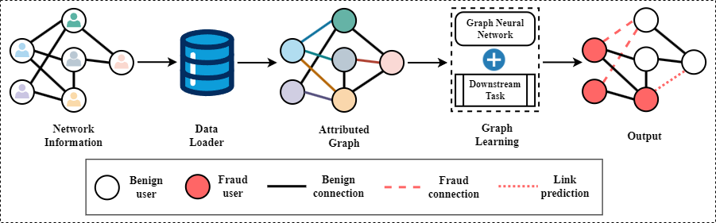
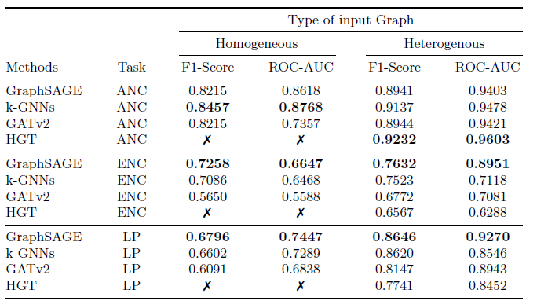

# Hive Social Network Anomaly Behavior Analysis

This repo contains the models, experiment notebooks along with the HiveABN dataset.

You can found the dataset here [Dataset](dataset)

## Data Description
We provide a dataset consisting of two parts:
1. Raw data: These are the data blocks of the decentralized social network Hive.Blog. Specifically, these are transactions in July 2022.
2. Processed data used for constructing a graph consists of two main input datasets: Nodes and Edges.
   Which contains attributes such as:
   - Node: ID, Type, Value, HP, Total vote, No. Follower, No. Following, Created, Post Count, Reputation.
   - Edge: Source, Target, Type, Timestamp, Weight.

With this processed data, we can build up the relationship between nodes and edges:



Anomalous cases versus normal cases across different types of node and edges in the HiveABN dataset:



## GABA Framework

**G**raph Neural Networks framework for **A**nomaly **B**ehavior **A**nalysis 


## Experiments

We conduct the experiment on three graph anomaly analysis tasks, using homogeneous and heterogenous graph structure:

- Anomaly Node Classification (ANC).
- Anomaly Edge Classification (AEC).
- Link Prediction (LP).

Experiment results on HiveABN using Homogeneous and Homogeneous graph representation. Since HGT is specifically designed to handle heterogeneous graphs, we do not apply homogeneous graph data to it, represented by **X**.




## Getting Started

### Dependencies

* torch
* lightning
* torch_geometric
* wandb

### Data organization

The data is organized in the following format:

```
/dataset/hive/
          └── <<version>>/
                  ├── edges_labelled.csv
                  └── nodes_labelled.csv
```

### Executing program

We are currently providing experiment codes in Jupyter notebooks. The running scripts will be provided in the future.

Before executing the notebook, install the hive_analysis model by running:
```sh
$ pip install -e .
```

## Version History

* 1.0.0
    * Initial Release

<!-- ## License

This project is licensed under the MIT License - see the LICENSE.md file for details -->

<!-- ## Acknowledgments -->
<!-- 
Inspiration, code snippets, etc.
* [awesome-readme](https://github.com/matiassingers/awesome-readme)
* [PurpleBooth](https://gist.github.com/PurpleBooth/109311bb0361f32d87a2)
* [dbader](https://github.com/dbader/readme-template)
* [zenorocha](https://gist.github.com/zenorocha/4526327)
* [fvcproductions](https://gist.github.com/fvcproductions/1bfc2d4aecb01a834b46) -->
